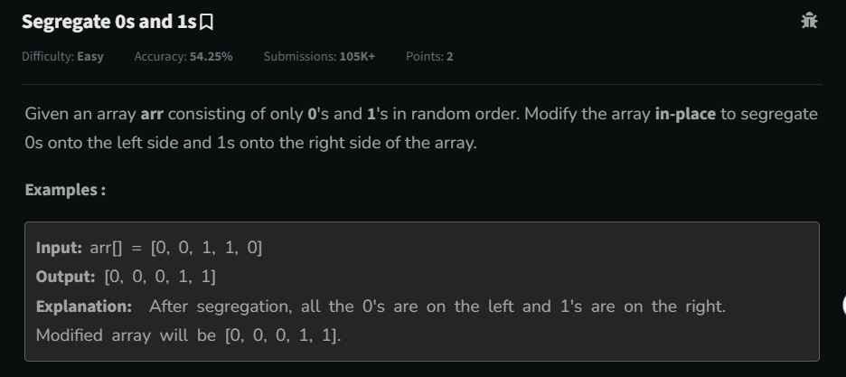
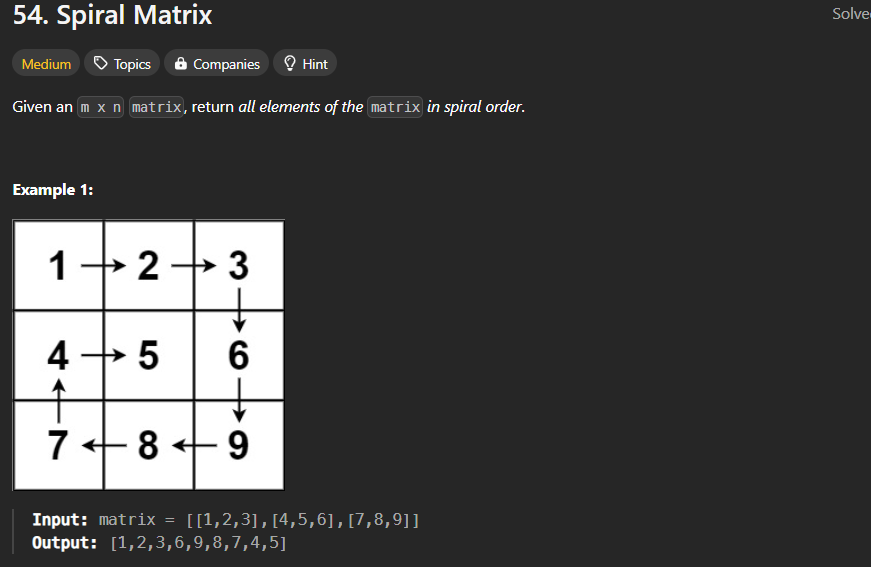
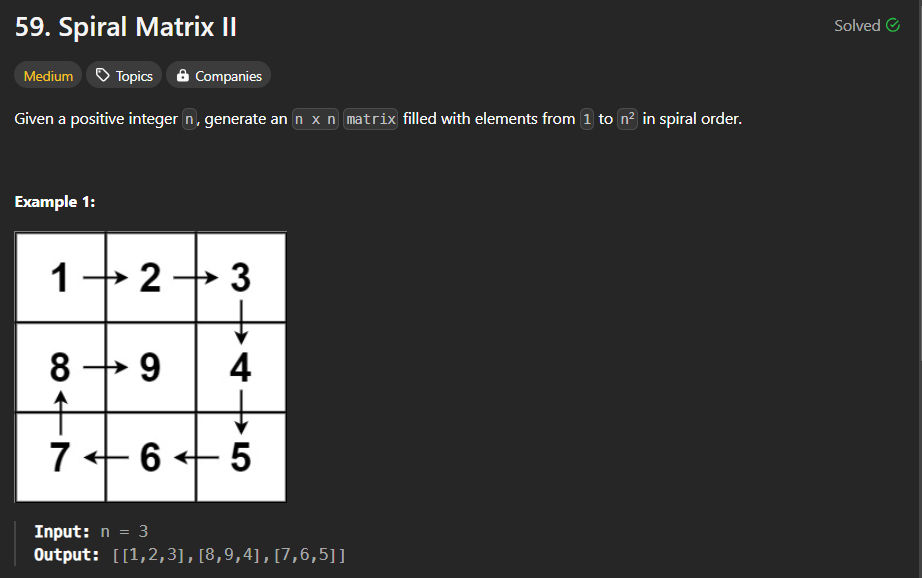
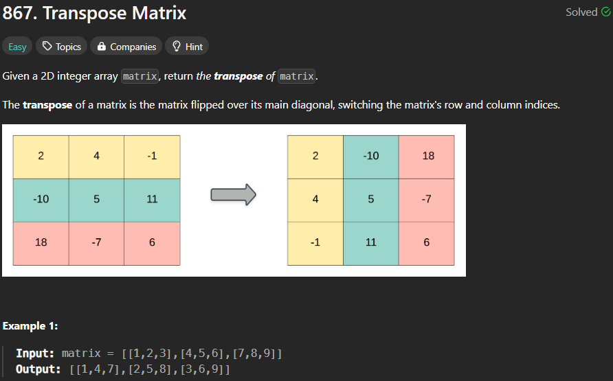
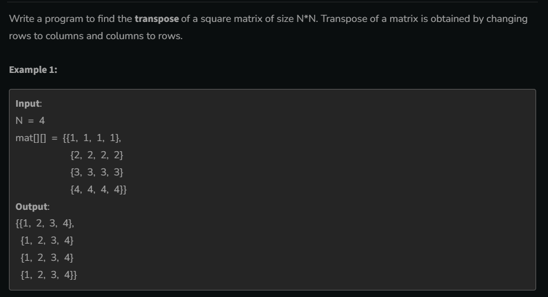
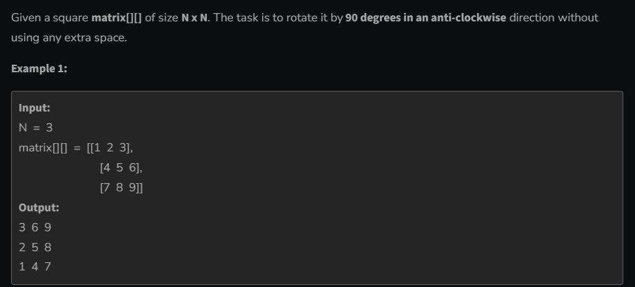
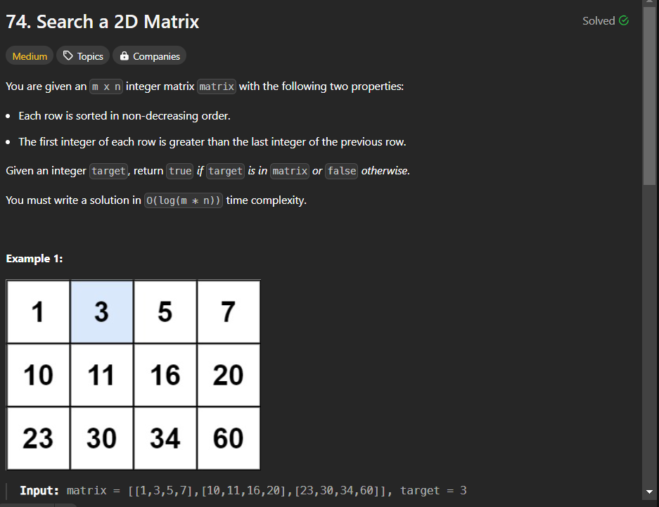
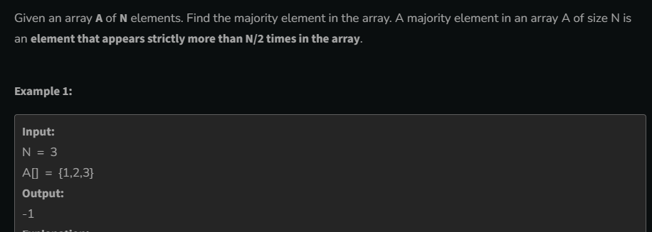

# DSA_
Two_Pointer_And_PrifixSum
---
# Segregate 0 and 1



### mathod 1 - Sorting

- by using bubble / insertion / selection time O(N^2)
- by using sorting function it take O(nlogn)

```cpp
sort(arr.begin(),arr.end());
```

### Method 2 - count 0 and count 1

```cpp
int cnt0 = 0;
int cnt1 = 0;
for(int i =0;i<n;i++){
    if(arr[i]==0)cnt0++;
    else cnt1++;
}
for(int i =0;i<cnt0;i++)
arr[i]=0;
for(int i = cnt0;i<n;i++)
arr[i]=1;
```

- Time Complexity O(n)

### Method 3 - Using Two Pointer

- take st and end pointer if st point is 0 then it move and end
  point 1 then it move towords the st when the point reverse value then <b>swap</b> them

```cpp
int st = 0,end=n-1;
while(st<end){
    if(arr[st]==0)st++;
    else{
        if(arr[end]==1){
            swap(arr[st],arr[end]);
            st++;
            end--;
     }
        else
        end--;
       }
}
```

---

# Two Sum II - Input Array Is Sorted


### Method 1 - Broute force App.
- time complexity O(n^2)
```cpp
vector<int> twoSum(vector<int>& arr, int target) {
        int n = arr.size();
        for (int i = 0; i < n - 1; i++)
            for (int j = i + 1; j < n; j++)
                if (arr[i] + arr[j] == target)return {i+1,j+1};
        return {};          
}
```
### method 2 - using binary search
- because of sorting nature array we take one by one element arr[i] and search all remaing <b>target - arr[i]
- O(n*long(n))
```cpp
vector<int> twoSum(vector<int>& arr, int target) {

 int n = arr.size();
        for (int i = 0; i < n - 1; i++) {
            // binary search
            int st = i + 1, end = n - 1, key = target - arr[i];
            while (st <= end) {
                int mid = (st + end) / 2;
                if (arr[mid] == key)
                    return {i + 1, mid + 1};
                else if (arr[mid] > key)
                    end = mid - 1;
                else
                    st = mid + 1;
            }
        }
        return {};
}
```

### method 3 - Two pointer
- when we move starting point to right then value increses and when we move end point to left then value will decreases
- ## can be apply only sorted array
O(n)  time complxity

```cpp
 vector<int> twoSum(vector<int>& arr, int target) {

        int st = 0, end = arr.size() - 1;
        while (st < end) {
            int key = arr[st] + arr[end];
            if (key == target)
                return {st + 1, end + 1};
            else if (key < target)
                st++;
            else
                end--;
        }
        return {};

    }
```
----
# Pair with Given Difference


### Method -1  Broute force approch
```cpp
int findPair(int n, int x, vector<int> &arr)
{
    sort(arr.begin(), arr.end());
    for (int i = 0; i < n - 1; i++)
        for (int j = i + 1; j < n; j++)
            if (arr[j] - arr[i] == x)
                return 1;
    return -1;
}
```
### Method-2 Binary Search approch
```cpp
int findPair(int n, int x, vector<int> &arr)
{
    sort(arr.begin(), arr.end());
    for (int i = 0; i < n - 1; i++)
    {  
        int st = i + 1, end = n - 1, mid;
        int key = x + arr[i];
        while (st <= end)
        {
            mid = (st + end) / 2;
            if (arr[mid] == key)return 1;
            else if (arr[mid] > key) end = mid - 1;
            else st = mid + 1;       
        }
    }
    return -1;
}

```
### method-3 two pointer
- put st and end at that point , where they move one side then the value change (inc&dec) for each one 
- after sorting..
- we put st at 0 and end at 1 and take diff , if diff is less than actual diff than we move the end at right side , and if diff is greater than actual diff than we move st in right side;

```cpp
int findPair(int n, int x, vector<int> &arr)
{
    sort(arr.begin(), arr.end());
    int st = 0, end = 1;
    while (end < n)
    {
        int key = arr[end] - arr[st];
        if (key == x)return 1;
        else if (key < x)end++;
        else st++;
        // important step
        if (st == end) end++;
    }
    return -1;
}
```
> both side st and end give same type of effect the both st and end will be one side or both in st or both in end.


> # Prifix And Suffix Sum

# Divide array in 2 subarray with equal sum

### Method-1 , broute force approch
Time complexity will be O(n^2)
```cpp
for(int i =0;i<n-1;i++){
    int sum1 =0,sum2 = 0;
    for(int j =0;j<=i; j++)
    sum1+= arr[j];
    for(int j =n;j>i;j--)
    sum2+=arr[j];
    if(sum1==sum2)return 1;
}
return 0;
```
### Method-2 , using Prifix sum
using prifix sum compair total sum-prifixsum
```cpp
int totalSum = 0;
for (int i = 0; i < n; i++)totalSum += arr[i];
int prifixSum = 0;
for (int i = 0; i < n - 1; i++)
{
    prifixSum += arr[i];
    if (2 * prifixSum == totalSum) return 1;
}
return 0;
```
#  Maximum Subarray

### method -1
find all the subarray sum and return the max sum.
```cpp
int maxSum = INT_MIN;
        for (int i = 0; i < nums.size(); i++) {
            for (int j = i; j < nums.size(); j++) {
                sum = 0;
                for (int k = i; k <= j; k++) {
                    sum += nums[k];
                }
                maxSum = max(sum, maxSum);
            }
        }
        return maxSum;
```
### method -2 , using prifix sum
*let array is 5 size and when PrifixSum start at*

**index-0** 
- {0} , {0,1} , {0,1,2} , {0,1,2,3} , {0,1,2,3,4},

**index-1** 
- {1} , {1,2} , {1,2,3} , {1,2,3,4},

**index-2** 
- {2} , {2,3} , {2,3,4},

**index-3** 
- {3} , {3,4},

**index-4** 
- {4},

> this is all sumArray and their sum in form of prifix sum and take max
```cpp
 int maxSum =INT_MIN;
        for(int i =0;i<nums.size();i++){
            int sum =0;
            for(int j =i;j<nums.size();j++){
                sum += nums[j];
            maxSum = max(maxSum,sum);}
        }
 return maxSum;
```
### Method-3, Kadane's Algorithm IMPORTANT
> find PriFixSum and when prifix sum is **NEGATIVE** then make it **ZERO**.
```cpp
int maxSum = nums[0],prifixSum = 0;
        for (int i = 0; i < nums.size(); i++) {
             if (prifixSum < 0)
                prifixSum = 0;
            prifixSum += nums[i];
            maxSum = max(maxSum, prifixSum);}
            
return maxSum;
```
*why*  because -ve prifix always dec the continous sum.

# Max Diff B/W 2 Element

### Method-1 ,BrouteForce Approch
not greater element alwys should be in right side
```cpp
int maximumDifference(vector<int>& arr) {
        int ans = INT_MIN, n = arr.size();
        for (int i = 0; i < n - 1; i++)
            for (int j = i; j < n; j++)
                ans = max(ans, arr[j] - arr[i]);
        return ans > 0 ? ans : -1;
    }
```
### Method-2, Suffix Max IMP
form the last we make a suffix array after this traverse 
onr by one and find diff max

```cpp
 int maximumDifference(vector<int>& arr) {
        int n = arr.size(), ans = INT_MIN;
        int suffix[n];
        suffix[n - 1] = arr[n - 1];
        for (int i = n - 2; i >= 0; i--)
            suffix[i + 1] > arr[i] ? suffix[i] = suffix[i + 1]: suffix[i] = arr[i];   
        for (int i = 0; i < n; i++)
            ans = max(ans, suffix[i] - arr[i]);
        return ans > 0 ? ans : -1;
    }
```

# Traping Rain Water 

### method-1 , using broute Force
>Approch- At any point we take min(maxOfLeft , maxOfRight) and if it is greater than then
ans+= (mini-arr[i])

in broute Force approch find leftmax/prifixMax using loop and rightmax/suffixMax using loop

### method-2 , using suffixMax , prifixMax
in b/w we find the suffixMax array and prifixMax array 
suffixMax[i] = maxElement in all left part
prifixMax[i] = maxElement in all righr part

```cpp
   int trap(vector<int>& arr) {
        int n = arr.size(), suffixMax[n], prifixMax[n], ans = 0;
        suffixMax[n - 1] = arr[n - 1];
        prifixMax[0] = arr[0];
        // constructing prifixMax arry
        for (int i = 1; i < n; i++)
            prifixMax[i] = max(arr[i], prifixMax[i - 1]);
        // constructing suffixMax array
        for (int i = n - 2; i >= 0; i--)
            suffixMax[i] = max(arr[i], suffixMax[i + 1]);
        // calculating all traped water
        for (int i = 1; i < n - 1; i++) {
            int minh = min(suffixMax[i], prifixMax[i]);
            if (minh > arr[i])
                ans += (minh - arr[i]);
        }
        return ans;
    }
```
### method -3   Optmize the space Best solution
in b/w we first calculate the index which has max val,
and calculate left part from left and right part from right.
```cpp
int trap(vector<int> &arr)
{
    int maxValIndex = 0, n = arr.size(),leftMax = 0, rightMax = 0, ans = 0;
    // calculate maxVal Index
    for (int i = 1; i < n; i++)
        if (arr[maxValIndex] < arr[i]) maxValIndex = i;
    // calculte left part
    for (int i = 0; i < maxValIndex; i++)
        if (leftMax > arr[i]) ans += leftMax - arr[i];
        else leftMax = arr[i];

    // calculate right part
    for (int i = n - 1; i > maxValIndex; i--)
        if (rightMax > arr[i])ans += rightMax - arr[i];
    else rightMax = arr[i];

    return ans;
}
```
> It can be solve in one loop using two pointer 

# 3 Sum

### Method-1 Broute force
```cpp
 bool find3Numbers(int arr[], int n, int x) {
        for (int i = 0; i < n - 2; i++)
            for (int j = i+1; j < n - 1; j++)
                for (int k = i+2; k < n; k++)
                    if ((arr[i] + arr[j] + arr[k]) == x)return 1;
        return 0;   
    }
```
## Method -2 , Two pointer approch
>It is easy like 2 Sum problem ,
we convert 3 sum problem into Two sum Problem.

```cpp
bool find3Numbers(int arr[], int n, int x) {

    sort(arr, arr + n);
    for (int i = 0; i < n - 2; i++) {
        int key = x - arr[i];
        // from here 2 Sum approch 
        int st = i + 1, end = n - 1;
        while (st < end) {
            int sum = arr[st] + arr[end];
            if (sum == key)return 1;
            else if (sum < key)st++;
            else end--;
        }
    }
    return 0;

}
```
# 4 Sum 

### Method-1 Broute Force 
using 4 loop and chack it
```cpp
bool find4Numbers(int arr[], int n, int X) {
    for (int i = 0; i < n - 3; i++)
        for (int j = i + 1; j < n - 2; j++)
            for (int k = j + 1; k < n - 1; k++)
                for (int l = k + 1; l < n; l++)
                    if (arr[i] + arr[j] + arr[k] + arr[l] == X)
                        return 1;
    return 0;
}
```
### Method-2 by Using two pointer
 first we convert the problen in 3 sum and then convert it in 2 sum ans solve 

 ```cpp
 bool find4Numbers(int arr[], int n, int X) {
    sort(arr, arr + n);
    for (int i = 0; i < n - 3; i++) {
        for (int j = i + 1; j < n - 2; j++) {
            int target = X - (arr[j] + arr[i]);
            int st = j + 1, end = n - 1;
            while (st < end) {
                int key = arr[st] + arr[end];
                if (key == target) return 1;
                else if (key < target)st++;
                else end--;
            }
        }
    }
    return 0;
}
```
---
> # 2D Array   
- value is in the form of row and col
- array element store in continous manner/liner fassion
- in momory nth elmenet 
> Index= row_index*col + col_index

*see formuls and get the proof of*
> row_index = Index/col 

> col_index = Index % col  

in 1D array 
> arr[ind] = Base_add + ind * sizeOfElement

in 2D array 
> arr[row][col] = base_add + Index *sizeOfElement

>## arr[i][j] = Base_add +( i * col + j) * sizeOfElement

## Creation of array
- int arr[4][3]
- int arr[2][3] = { 1,2,3,4,5,6 };

*pass A 2D array* 
>## function ( arr[][col] )

<br/>

# ADD TWO MATRIX
```cpp
    int ans[row][col];
    for(int i =0;i<row;i++)
    for(int j =0;j<col;j++)
    ans[i][j]=arr[i][j]+brr[i][j];
    return arr;
```
# Print Row index with Max Sum
```cpp
int ansIndex = -1, maxSum = INT_MIN;
for (int i = 0; i < row; i++) {
    int sum = 0;
    for (int j = 0; j < col; j++)
        sum += arr[i][j];
    if (sum > maxSum) {
        maxSum = sum;
        ansIndex = i;
    }
}
return ansIndex;
```
# Print Sum of Digonal
```cpp
for(int i =0;i<row;i++)
{ 
    // (0,0) se start diog
    ans1+=arr[i][i];
    // (row , row) se start ho 
    ans2+=arr[i][row-i-1];
}
```
# Reverse each row of Matrix
```cpp
for(int i =0;i<row;i++){
    //reverse i th row
    for(int j =0;j<col/2;j++)
    swap(arr[i][j],arr[i][col-j-1]);
}
```
# Vector 2D
```cpp
vector<vector<int>>arr;
vector<vector<int>>arr(row , vector<int>(col,val));
// row and col 
int row = arr.size();
int col = arr[0].size();
```
# Print a 2D vector in WAVE form like sin graph
```cpp
for(int j =0;j<col;j++){
    if(j&1)
    for(int i =row-1;i>=0;i--)
    cout<arr[i][j];
    else
    for(int i =0;i<row;i++)
    cout<<arr[i][j];
}
```
# Print a matrix in  Spiral from

   - first top , second right ,third bottom and at the last 
   print left ,
```cpp
 vector<int> spiralOrder(vector<vector<int>>& arr) {
        int top = 0;
        int bottom = arr.size() - 1; // row
        int left = 0;
        int right = arr[0].size() - 1; // col
        vector<int> ans;
        while (top <= bottom && left <= right) {
            // print top
            for (int i = left; i <= right; i++)
                ans.push_back(arr[top][i]);
            top++;
            // print right
            for (int i = top; i <= bottom; i++)
                ans.push_back(arr[i][right]);
            right--;
            // print bottom
            if (top <= bottom) {
                for (int i = right; i >= left; i--)
                    ans.push_back(arr[bottom][i]);
                bottom--;
            }
            // print left
            if (left <= right) {
                for (int i = bottom; i >= top; i--)
                    ans.push_back(arr[i][left]);
                left++;
            }
        }
        return ans;
    }
```
# spiral Matrix -II 
print the matrix in the spiral order 


```cpp
 vector<vector<int>> generateMatrix(int n) {
        vector<vector<int>> ans(n, vector<int>(n, 0));
        int left = 0, right = n - 1, top = 0, bottom = n - 1, num = 1;
        while (left <= right && top <= bottom) {

            for (int i = left; i <= right; i++) 
                ans[top][i] = num++;
            top++;

            for (int i = top; i <= bottom; i++) 
                ans[i][right] = num++;
            right--;

            for (int i = right; i >= left; i--) 
                ans[bottom][i] = num++;
            bottom--;

            for (int i = bottom; i >= top; i--) 
                ans[i][left] = num++;
            left++;
        }
        return ans;
    }
```
# Transpose of a matrix


 ```cpp
  vector<vector<int>> transpose(vector<vector<int>>& mat) {
        int row = mat.size(), col = mat[0].size();
        vector<vector<int>> ans(col, vector<int>(row, 0));
        for (int i = 0; i < row; i++)
            for (int j = 0; j < col; j++)
                ans[j][i] = mat[i][j];

        return ans;
```
# Transpose a matrix in O(1) space complexity

- This Mathod is work in only squre Matrix
```cpp
void transpose(vector<vector<int> >& mat, int n)
    {
         for (int i = 0; i <n-1; i++)
            for (int j = i + 1; j < n; j++)
                swap(mat[j][i], mat[i][j]);
    }
```
or 
- swap upper matrix or  lower matrix only
```cpp
 void transpose(vector<vector<int> >& mat, int n)
    {
         for (int i = 0; i <n; i++)
            for (int j = 0; j < n; j++)
               if(i>j) swap(mat[j][i], mat[i][j]);
    }
```
# Rotate Image 90 Degree

### method-1 , By taking a new ans Matrix
```cpp
void rotate(vector<vector<int>>& mat) {
        int n = mat.size();
        vector<vector<int>>ans(n,vector<int>(n,0));
        // make new matrix
        for (int i = 0; i < n; i++)
            for (int j = 0; j < n; j++)
                ans[j][n-i-1] = mat[i][j];
       
         // use the new matrix
        for (int i = 0; i < n; i++)
            for (int j = 0; j < n ; j++)
                mat[i][j] = ans[i][j];
       
    }
```
### Method -2 , Optimize space complexity
- by observing the image for 90 rotation
(col->reverse)'s transpose = 90* rotaion
or first transpose than reverse the row 

```cpp
 void rotate(vector<vector<int>>& mat) {
        int col = mat[0].size(), row = mat.size();
        // transpose
        for (int i = 0; i < row; i++)
            for (int j = 0; j < col; j++)
                if (i > j)swap(mat[i][j], mat[j][i]);
        // revese row
        for (int i = 0; i < row; i++)
            for (int j = 0; j < col / 2; j++)
                swap(mat[i][j], mat[i][col - j - 1]);
    }
```
# Rotated matrix 180 
> For the 180* ratation two time 90 or use other observation

or using one time row reverse and one time col reverse 
```cpp
  void rotate(vector<vector<int>>& mat) {
        int n = mat.size();
        // row reverse
        for (int i = 0; i < n; i++)
            for (int j = 0; j < n / 2; j++)
                swap(mat[i][j], mat[i][n - j - 1]);
        // col ratation
        for (int i = 0; i < n / 2; i++)
            for (int j = 0; j < n; j++)
                swap(mat[i][j], mat[n - i - 1][j]);
    }
```
# Rotate a matrix 90* AntiClock wise

in this qution we take the transpose of the given matrix ,
after this we will reverse the cols
```cpp
 void rotate(vector<vector<int>>& mat) {
        int n = mat.size();
        // transpose
        for (int i = 0; i < n; i++)
            for (int j = 0; j < n; j++)
                if (i > j)
                    swap(mat[i][j], mat[j][i]);
        // reverse col
        for (int i = 0; i < n / 2; i++)
            for (int j = 0; j < n; j++)
                swap(mat[i][j], mat[n - 1 - i][j]);
    }
```
# Rotate a Matrix K time
k%4 == 0 --> No rotaion

k%4 == 1 ---> that represent 90* clockWise rotaion --> transpose + row reverse 

k%4 == 2 ---> that represent 180* rotation --> row reverse + col Reverse 

k%4 == 3 ---> that represent 270* / AntiClock Rotaion --> transpose + col Reverse

```cpp
void Rotat90(vector<vector<int>>&mat,int n){
    // transpose 
    for(int i =0;i<n-1;i++)
    for(int j = i+1;j<n;j++)
    swap(mat[i][j],mat[j][i]);
// reverse row
for (int i = 0; i < row; i++)
            for (int j = 0; j < col / 2; j++)
                swap(mat[i][j], mat[i][col - j - 1]);
}

void RotedKTime(vector<vector<int>>&mat,int k,int n){
    k = k%4;
    while(k--)
    Rotat90(mat,n);
}
```

# Search in 2D matrix

### method-1 , Using leanerSerch O(n^2)
```cpp
  bool searchMatrix(vector<vector<int>>& mat, int key) {
        for (int i = 0; i < mat.size(); i++)
            for (int j = 0; j < mat[0].size(); j++)
                if (mat[i][j] == key)
                    return 1;
        return 0;
    }
```
### Using binary search in specfic row O(NlogN)
```cpp
 bool searchMatrix(vector<vector<int>>& mat, int key) {
        int row = mat.size(), col = mat[0].size();
        for (int i = 0; i < row; i++)
            if (mat[i][0] <= key && key <= mat[i][col - 1]) {
                int st = 0, end = col - 1, mid;
                while (st <= end) {
                    mid = (st + end) / 2;
                    if (mat[i][mid] == key)
                        return 1;
                    else if (mat[i][mid] > key)
                        end = mid - 1;
                    else
                        st = mid + 1;
                }
            }
        return 0;
    }
```

### USing pure Binary seach App O(log(n*n))
*row = index/col , col = index%col*

```cpp
 bool searchMatrix(vector<vector<int>>& mat, int key) {
        int row = mat.size(), col = mat[0].size();
        int st = 0, end = row * col - 1;
        while (st <= end) {
            int mid = (st + end) / 2;
            int r = mid / col, c = mid % col;
            if (mat[r][c] == key)return 1;
            else if (mat[r][c] > key)end = mid - 1;
            else st = mid + 1;
        }
        return 0;
    }
```

# Search in a row-colmun sorted Matrix


- it can be solve by using linear search O(n^2)
- it can solve by first select row and apply in row binary search
# most optimize way # Important
in this mathod we take i , a row index and j a col index , 
at any point we can move it left to change the col (j--), it can move 
in down for change the row number (i++);

> i and j can be only most(top-Right) or most(bottom-left) bcz 
at this this point move left value is dec and move bottom value is increases

```cpp
 bool search(vector<vector<int>> mat, int n, int m, int x) {
    // start form most top-right
        int row = 0, col = m - 1;
        while (row <= n - 1 && col >= 0)
            if (mat[row][col] == x)return 1;
            else if (mat[row][col] < x)row++;
            else col--;
        
        return 0;
    }
```
- time complexity when it search most right col and most bottom col
**O(m+n)**
---
---
# IMPORTANT
> # Store two value in a variable
let you have 6 time 2 or (2,2,2,2,2,2) then how can you store num and it's 
frequency in a siingle variable.

take a number like 100 ,
**var = 2 + 6*100 ,,  var = 602 , for finding value and freq
## value = var%100, freq = var/100  
*same like finding row and col index  index
## row_index = index/col , col_index = index%col


# Find missing and reapting value 

- this can be solve using two loop broute force approch
### by the use of frequency array
```cpp
vector<int> findTwoElement(vector<int> arr, int n) {
    int freq[n + 1] = {0}, val1, val2;
    for (int i = 0; i < n; i++) freq[arr[i]]++;
    for (int i = 1; i <= n; i++) {
        if (freq[i] == 0) val1 = i;
        if (freq[i] == 2) val2 = i;
    }
    return {val2, val1};
}
```
### by using no extra space for the storege
- traverse element one by one , which value we get ,
go that index(arr[i]%n) we will increse that index value by n (+n)
something

```cpp
vector<int> findTwoElement(vector<int> arr, int n) {
    // first we subtract 1 from each to match the index from zero
    for (int i = 0; i < n; i++)arr[i]--;

    int val1, val2;
    for (int i = 0; i < n; i++)
        arr[arr[i] % n] += n; // this store the freq 

    for (int i = 0; i < n; i++) {
        if (arr[i] / n == 0)val1 = i + 1;
        if (arr[i] / n == 2)val2 = i + 1;
    }
    return {val2, val1};
}
```
# Mejority Element #important


## MOORE VOTING ALGORITHOM
if vote of candiate is zero then cur element is new condiate
if current element is the same candiate the vote++ , else vote--
```cpp
 int majorityElement(vector<int>& nums) {
        int candiate = 0,vote =0;
        for (int i = 0; i < nums.size(); i++) {
            if (vote == 0) candiate = nums[i];
            if (candiate == nums[i])vote++;
            else vote--;
        }
        return candiate;
    }
```
## gfg same question

```cpp
int candiate = 0,vote =0,n = nums.size();
        for (int i = 0; i < n; i++) {
            if (vote == 0)
                candiate = nums[i];
            if (candiate == nums[i])
                vote++;
            else
                vote--;
        }
    int cnt =0;
    for(int i =0;i<n;i++)if(nums[i]==candiate)cnt++;
    if(cnt>n/2)return candiate;
     return -1;
```     
---
---
> # STRING 
it use dynamic memory
## NULL CHARACTOR --> '\0'
```cpp
char arr[10];
cin>>arr;   // input is --> abcdefg
arr[2] = '\0';
cout<<arr;
// output of the code is ---> ab
// not print after the null charactor
```
in string
```cpp
  string str = "abce";
  str[3] = '\0';
  cout<<str; // output--> abc
```
cin not take input after (space , tab , enter)
```cpp
string str = "raj singh";
cout<<str; // output --> raj singh
//but 
string str1 ;
cin>>str1; // input --> raj singh
cout<<str1;  // output--> raj
```
take input whole line

```cpp
string str;
getline(cin,str);
cout<<str;
```
- scape charactor
after scape one charctor only print , and scape char will remove

```cpp
string str = "I am a \"good\" boy."
string str1 = "\\0";
cout<<str;  // output --> I am a "good" boy.
cout<<str1; //  output--> \0
```
but but 
```cpp
string str = "\0";
cout<<str;  // output -->   --> nothing
// the meaning pf \0 is print nothing
```
# Problem -->  
# Longest Palidrom

- odd the one time full all time odd freq-1 , and in the 
case of even frequency we add 

```cpp
 int longestPalindrome(string s) {
        unordered_map<char, int> mp;
        int ans = 0;
        bool flag = 0;
        for (auto x : s) mp[x]++;

        for (auto x : mp)
            x.second& 1 ? ans += x.second-1, flag = true : ans += x.second;
        if (flag) ans++;

        return ans;
    }
```

my solution
```cpp
 bool isVow(char x) {
        return (x == 'a' || x == 'e' || x == 'i' || x == 'o' || x == 'u' ||
                x == 'A' || x == 'E' || x == 'I' || x == 'O' || x == 'U');
    }

    string sortVowels(string st) {
        string vow = ""; 
        int j = 0;

        for (auto x : st)if (isVow(x))vow += x;

        sort(vow.begin(), vow.end());
      
        for (int i = 0; i < st.size(); i++)
            if (isVow(st[i])) st[i] = vow[j++];

        return st;
    }
```

# Add String  #IMPORTANT


- in this question we start the traversing from last and 
add with carry while all(first num, second num and carry) end.
we update the carry by *carray = sum/10*
and we update the ans by *ans += (sum%10)+'0';
```cpp
  string addStrings(string num1, string num2) {
        int i = num1.size() - 1, j = num2.size() - 1, carry = 0;
        string ans = "";
        while (i >= 0 || j >= 0 || carry) {
            int sum = carry;
            if (i >= 0)sum += num1[i--] - '0';
            if (j >= 0)sum += num2[j--] - '0';
            ans += (sum % 10) + '0';
            carry = sum / 10;
        }
        reverse(ans.begin(),ans.end());
        return ans;
    }
```


---
# pointer
```cpp
int a = 5;
int b = 4;
// for know the add.
cout<<&a<<" ";
// for store the addof any variable use Pointer
int *ptr = &a;
// print add of a 
cout<<ptr;

```
- by **symble table** , lets varible a and b has a memory address
400 , 500 and at the 400 memory address , value present is 5 and 
at he 500 memory address value is 4 presen.

```cpp
float a = 1.2;
float *ptr = &a; // use * when pointer create
cout<<&a<<" "<<ptr ; // both value will same
cout<<*ptr; // 1.2 vale at the ptr address
```

> ## size of pointer
```cpp
int a = 12;
float b =1234.4;
int *ptr1 = &a;
float *ptr2 = &b;
cout<<sizeof(ptr1)<<" "<< sizeof(ptr2); // 4  4 
```
size of pointer will not depend upon data type 
it only depend **RAM-SIZE** if RAM is 4GB then all pointer
will be 4 byte if 8GB the 8 byte if 16 than it will be 16 byte
```cpp
int a = 10;
int b = 13;
int *ptr = &a;

ptr = &b;
*ptr = 123;

cout<<b<<endl; // 123
// now pointer is pointing b not a
```


